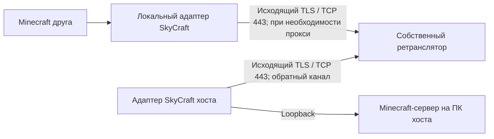

# Сетевой прототип SkyCraft YS

Версия Fabric: **0.1.2-ys.network.1**. Совместима по формату shared memory с
исходным SKSE-плагином 0.1.2: протокол не менялся. Полная проверка в Skyrim
и между двумя настоящими игровыми клиентами ещё не выполнена.

## Как подключаться

1. В своём мире открыть чат (**T**) и выполнить `/skycraft host 25565`.
2. Друг выполняет `/join адрес-хоста:25565`. Для LAN это адрес компьютера хоста
   в локальной сети; для Интернета нужен доступный извне адрес и порт.
3. `/leave` возвращает в свой мир. Неудачный вход также возвращает в свой мир;
   `join=` не вызывает бесконечных повторов в пределах одного запуска.
4. `/skycraft netcheck адрес:порт` проверяет установку TCP-соединения выбранным
   способом. Успех проверки не подтверждает вход в Minecraft, версии модов
   или синхронизацию Skyrim.
5. `/skycraft address адрес:порт` задаёт адрес для кнопки Join в Discord на эту
   сессию. Команда работает после открытия хоста. Адрес должен быть доступен
   другу; публикация приглашения не пробрасывает порт через роутер.

e4mc больше не является зависимостью и не включается в новые пакеты. В своём
Prism-экземпляре его старый JAR нужно убрать при переходе на прототип.
Встроенный обновлятор сохраняет очистку старых e4mc JAR при обновлении пакета.

## Настройки экземпляра Minecraft

Файл `config/skycraft.properties` в каталоге Minecraft нужного экземпляра.
Существующий файл сохраняется; отсутствующие поля используют значения по
умолчанию. Новый файл создаётся с шаблоном в UTF-8.

```properties
join=
network.mode=DIRECT
network.proxy=127.0.0.1:1080
network.proxy.username=
network.proxy.password=
network.timeoutMillis=10000
network.hostPort=25565
network.advertisedAddress=
```

`DIRECT` использует обычный путь подключения Minecraft. `SOCKS5` и
`HTTP_CONNECT` передают TCP через указанный прокси. Адрес прокси задаётся как
`имя:порт`; схема URL не нужна. Имя **целевого сервера** передаётся прокси для
разрешения DNS; адрес самого прокси должен разрешаться локально или быть IP.
Для IPv6: `[2001:db8::1]:25565`. При использовании прокси укажите точный порт
сервера: поиск Minecraft SRV-записей через прокси не реализован.

Пример локального SOCKS-прокси вашего VPN-клиента:

```properties
network.mode=SOCKS5
network.proxy=127.0.0.1:1080
```

Для HTTP-прокси выбрать `HTTP_CONNECT` и его фактический порт. Некоторые
HTTP-прокси разрешают CONNECT только на 443 и отклонят Minecraft на 25565;
диагностика покажет код отказа. Можно использовать доступный сервер на 443,
если прокси разрешает такой трафик. Сам CONNECT не превращает Minecraft в HTTPS.

Настройки перечитываются при `/join`, `/skycraft host` и `/skycraft netcheck`.
Настройка системного прокси автоматически не импортируется. Мод не меняет
системные маршруты, DNS, VPN и zapret. Этот транспорт обслуживает игровое
TCP-соединение; загрузка ресурсов, Microsoft-авторизация и HTTP Minecraft
остаются в своих обычных сетевых путях.

Авторизация: SOCKS5 username/password или HTTP Basic. Удалённый обычный HTTP/
SOCKS-прокси не шифрует сам обмен паролем; предпочтителен локальный прокси
VPN-клиента либо уже защищённый канал. Настройки пароля хранятся локально;
сводка конфигурации и сообщения отказов их не печатают. Не публикуйте весь
конфиг, если добавили пароль.

## Что проверено

Автоматические тесты создают настоящие локальные TCP-сокеты и тестовые прокси:

- DIRECT, SOCKS5 с удалённым DNS и HTTP CONNECT;
- username/password, отказ авторизации и отказ от незапрошенного понижения
  SOCKS5 до режима без авторизации;
- фрагментированные ответы, сохранение первых байтов игрового потока;
- ограничение размера HTTP-заголовка, таймаут и отмена зависшего согласования;
- передача более 1 МиБ в обе стороны и ответ после закрытия направления записи;
- закрытие сокетов, IPv6/IDN, некорректные адреса и сохранение старого конфига.

Проверка 2026-10-03: Java/Fabric собирается, все **50 JUnit-тестов** проходят
(29 сетевых и 21 прежний тест геометрии). Проверка `NetworkSmoke` с настоящим
Minecraft 26.3 / Fabric Loader 0.19.5 прошла: HTTP CONNECT, применение Mixin
и исходный адрес в пакете входа подтверждены. Тестовый сервер заканчивает
соединение после пакета входа; игровой мир, сохранения и второй игрок в этой
проверке не участвуют. Матрица реальных сетей пока не выполнена: доступен
один компьютер.

Повторяемые проверки из корня исходников:

```powershell
powershell -ExecutionPolicy Bypass -File tools/dev.ps1 -Action BuildFabric
powershell -ExecutionPolicy Bypass -File tools/dev.ps1 -Action NetworkSmoke
```

`NetworkSmoke` запускает отдельный клиент с тестовым HTTP-прокси, проверяет
настоящий пакет входа Minecraft (адрес назначения вместо локального порта
моста), затем закрывает клиент. Его конфиг, журнал и результат находятся
в `.tools/network-smoke-game`; тестовый мод не входит в выпускной JAR.
Эта проверка не загружает мир и не заменяет игровую приёмку.

## Следующий транспорт без стороннего аккаунта

Прямое подключение остаётся первым вариантом. Если входящие соединения закрыты
у обоих игроков, потребуется хотя бы один узел с доступным извне портом:
компьютер участника с публичным IPv4/IPv6 или отдельный собственный сервер.
Игровой сервер при этом может оставаться на компьютере игрока.
Публичный бесплатный ретранслятор без регистрации пока не выбран.

План собственного ретранслятора (ещё **не реализован**):



Ретранслятор соединяет только участников одной комнаты с криптографически
случайным ключом приглашения. Нужны проверка TLS-сертификата, ограничения
клиентов/ресурсов, таймауты, восстановление управляющего канала и отказ от
произвольного перенаправления адресов. Два исходящих канала решают проблему
входящего NAT; доступность самого ретранслятора при фильтрации проверяется
отдельно. UDP для Skyrim Together потребует отдельного канала датаграмм,
а перенос через TCP при потере пакетов может повысить задержку.

## Ручная приёмка

На отдельном тестовом мире: открыть хост, войти вторым клиентом, двигаться,
поставить блок, выйти, переподключиться; отключить хост и проверить возврат
в свой мир. Проверить отмену кнопкой и неправильный пароль прокси.
Затем повторить в LAN, разных NAT/CGNAT, при недоступном UDP, с VPN-туннелем,
системным прокси, Cloudflare One Client, zapret и их нужными сочетаниями.
Записывать режим, задержку/обрывы и ошибки из `logs/latest.log` обоих клиентов.

Прокси-протоколы: [SOCKS5, RFC 1928](https://www.rfc-editor.org/rfc/rfc1928),
[HTTP CONNECT, RFC 9110](https://www.rfc-editor.org/rfc/rfc9110.html#section-9.3.6).
