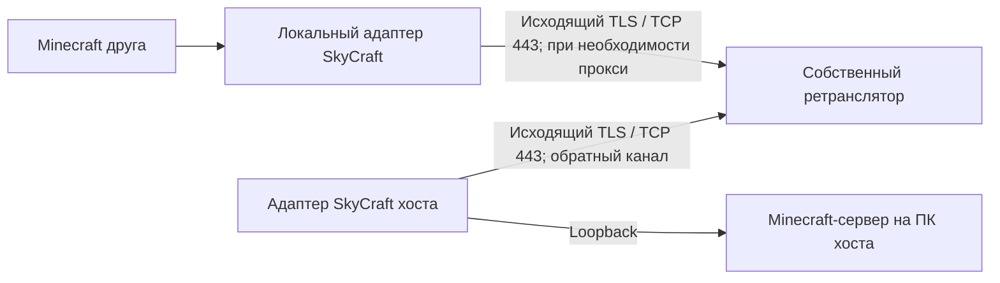

# Сетевой прототип SkyCraft YS

Версия Fabric: **0.1.2-ys.network.2**. Совместима по формату shared memory с
исходным SKSE-плагином 0.1.2: протокол не менялся. На текущем ПК проверены
запуск через MO2/SKSE, HUD и движение в загруженном сохранении. Игра двух
пользователей и реальные сочетания VPN ещё требуют проверки.

## Как подключаться

1. В своём мире открыть чат (**T**) и выполнить `/skycraft host 25565`.
2. Получите адрес по [подробной инструкции](YS-TESTING.md#как-получить-адрес-хоста):
   LAN IPv4 компьютера хоста либо WAN IPv4 роутера с проброшенным TCP-портом,
   либо проверенный глобальный IPv6. Друг выполняет `/join` с этим адресом и
   нужным внешним портом. Инструкция содержит команды и поля интерфейса.
3. `/leave` возвращает в свой мир. Неудачный вход также возвращает в свой мир;
   `join=` не вызывает бесконечных повторов в пределах одного запуска.
4. `/skycraft netcheck адрес:порт` проверяет установку TCP-соединения выбранным
   способом. Успех проверки не подтверждает вход в Minecraft, версии модов
   или синхронизацию Skyrim.
5. `/skycraft address адрес:порт` задаёт адрес для кнопки Join в Discord на эту
   сессию. Команда работает после открытия хоста. Адрес должен быть доступен
   другу; публикация приглашения не пробрасывает порт через роутер.

e4mc больше не является зависимостью и не включается в новые пакеты. В своём
Prism-экземпляре его старый JAR нужно убрать при переходе на прототип.
Встроенный обновлятор сохраняет очистку старых e4mc JAR при обновлении пакета.

## Настройки экземпляра Minecraft

Файл находится в **Prism → ПКМ по используемому экземпляру → Папка Minecraft →
config → skycraft.properties**. Откройте его в Блокноте при закрытых обеих
играх. Заменяйте существующую строку параметра; отсутствующую добавьте в конец,
один ключ — одна строка. Пустой `join` записывается буквально `join=`.
Нажмите Ctrl+S и заново запустите SKSE/MO2. Полный порядок с копиями и
объяснением путей — [G1–G8 инструкции](YS-TESTING.md); отдельная
[проверка на одном ПК](YS-SOLO.md).
Существующий файл сохраняется; отсутствующие поля используют значения по
умолчанию. Новый файл создаётся с шаблоном в UTF-8.

```properties
join=
network.mode=DIRECT
network.proxy=127.0.0.1:1080
network.proxy.username=
network.proxy.password=
network.timeoutMillis=10000
network.hostPort=25565
network.advertisedAddress=
```

`DIRECT` использует обычный путь подключения Minecraft. `SOCKS5` и
`HTTP_CONNECT` передают TCP через указанный прокси. Адрес прокси задаётся как
`имя:порт`; схема URL не нужна. Имя **целевого сервера** передаётся прокси для
разрешения DNS; адрес самого прокси должен разрешаться локально или быть IP.
Для IPv6: `[2001:db8::1]:25565`. При использовании прокси укажите точный порт
сервера: поиск Minecraft SRV-записей через прокси не реализован.

Пример локального SOCKS-прокси вашего VPN-клиента:

```properties
network.mode=SOCKS5
network.proxy=127.0.0.1:1080
```

Для HTTP-прокси выбрать `HTTP_CONNECT` и его фактический порт. Некоторые
HTTP-прокси разрешают CONNECT только на 443 и отклонят Minecraft на 25565;
диагностика покажет код отказа. Можно использовать доступный сервер на 443,
если прокси разрешает такой трафик. Сам CONNECT не превращает Minecraft в HTTPS.

Настройки перечитываются при `/join`, `/skycraft host` и `/skycraft netcheck`.
Настройка системного прокси автоматически не импортируется. Мод не меняет
системные маршруты, DNS, VPN и zapret. Этот транспорт обслуживает игровое
TCP-соединение; загрузка ресурсов, Microsoft-авторизация и HTTP Minecraft
остаются в своих обычных сетевых путях.

Авторизация: SOCKS5 username/password или HTTP Basic. Удалённый обычный HTTP/
SOCKS-прокси не шифрует сам обмен паролем; предпочтителен локальный прокси
VPN-клиента либо уже защищённый канал. Настройки пароля хранятся локально;
сводка конфигурации и сообщения отказов их не печатают. Не публикуйте весь
конфиг, если добавили пароль.

## Логгер и набор тестов

[Пошаговая инструкция для хоста и клиента](YS-TESTING.md) и
[таблица Excel с 25 сценариями](testing/SkyCraft-Network-Tests.xlsx) описывают
сбор данных, варианты VPN/Cloudflare/zapret и критерии результатов.
Таблица содержит 14 вкладок; «Сценарии подробно» — 288 строк с полным порядком
для каждого ID. [Версия HTML](testing/ИНСТРУКЦИЯ.html) открывается без Excel.
[Пакет для друга](YS-FRIEND.md) включает установщик обновления с резервной
копией, проверку версий и сбор автоматического лога запуска.

```text
/skycraft debug start L01_01 host
/skycraft debug mark HOST_READY
/skycraft debug status
/skycraft debug stop
```

На клиенте роль `client`, ID совпадает с хостом. JSONL в
`logs/skycraft-network` содержит этапы подключения, метки UTC, типы исключений,
коды ответов прокси, задержку игрока Minecraft и байты прокси-моста. Логгер
асинхронный, с ограниченной очередью и ротацией. Пароли/токены и содержимое
пакетов не записываются; IP/имена узлов и ручные метки записываются.

После `debug stop` подождите 2 секунды и запустите
`tools/collect-network-report.cmd`: мастер соберёт локальный ZIP со сводкой,
CSV событий/сокетов и снимком адаптеров/DNS/маршрутов. Активные режимы инструментов
указывает тестировщик. Полные игровые логи включаются отдельно; отправки
в Интернет нет. Без Python/JDK сборщик работает на Windows PowerShell 5.1+.

## Что проверено

Автоматические тесты создают настоящие локальные TCP-сокеты и тестовые прокси:

- DIRECT, SOCKS5 с удалённым DNS и HTTP CONNECT;
- username/password, отказ авторизации и отказ от незапрошенного понижения
  SOCKS5 до режима без авторизации;
- фрагментированные ответы, сохранение первых байтов игрового потока;
- ограничение размера HTTP-заголовка, таймаут и отмена зависшего согласования;
- передача более 1 МиБ в обе стороны и ответ после закрытия направления записи;
- закрытие сокетов, IPv6/IDN, некорректные адреса и сохранение старого конфига;
- UTF-8 JSONL, фильтрация секретных полей, ротация и работа при ошибке записи;
- счётчики передачи прокси-моста, устойчивость соединения к отказу наблюдателя.

Проверка 2026-10-03: Java/Fabric собирается, все **54 JUnit-теста** проходят
(33 сетевых/диагностических и 21 прежний тест геометрии). Проверка `NetworkSmoke` с настоящим
Minecraft 26.3 / Fabric Loader 0.19.5 прошла: HTTP CONNECT, применение Mixin
и исходный адрес в пакете входа подтверждены; события канала/прокси и завершение
JSONL также проверены. Сборщик Windows прошёл интеграционную проверку на
локальных TCP-соединениях и тестовых файлах: ZIP, IP/DNS-цели, сводка задержки,
безопасное открытие CSV, исключение паролей/конфигов/аккаунтов, предупреждение
при отсутствии лога. Тестовый сервер заканчивает
соединение после пакета входа; игровой мир, сохранения и второй игрок в этой
проверке не участвуют. Матрица реальных сетей пока не выполнена: доступен
один компьютер.

Повторяемые проверки из корня исходников:

```powershell
powershell -ExecutionPolicy Bypass -File tools/dev.ps1 -Action BuildFabric
powershell -ExecutionPolicy Bypass -File tools/dev.ps1 -Action NetworkSmoke
python tools/test-network-report.py
```

`NetworkSmoke` запускает отдельный клиент с тестовым HTTP-прокси, проверяет
настоящий пакет входа Minecraft (адрес назначения вместо локального порта
моста), затем закрывает клиент. Его конфиг, журнал и результат находятся
в `.tools/network-smoke-game`; тестовый мод не входит в выпускной JAR.
Эта проверка не загружает мир и не заменяет игровую приёмку.

## Следующий транспорт без стороннего аккаунта

Прямое подключение остаётся первым вариантом. Если входящие соединения закрыты
у обоих игроков, потребуется хотя бы один узел с доступным извне портом:
компьютер участника с публичным IPv4/IPv6 или отдельный собственный сервер.
Игровой сервер при этом может оставаться на компьютере игрока.
Публичный бесплатный ретранслятор без регистрации пока не выбран.

План собственного ретранслятора (ещё **не реализован**):



Ретранслятор соединяет только участников одной комнаты с криптографически
случайным ключом приглашения. Нужны проверка TLS-сертификата, ограничения
клиентов/ресурсов, таймауты, восстановление управляющего канала и отказ от
произвольного перенаправления адресов. Два исходящих канала решают проблему
входящего NAT; доступность самого ретранслятора при фильтрации проверяется
отдельно. UDP для Skyrim Together потребует отдельного канала датаграмм,
а перенос через TCP при потере пакетов может повысить задержку.

## Ручная приёмка

Начать с S01–S03 на одном ПК, затем выполнить L01/I01 с другом и нужные
сочетания N08/N09. Подробные действия и форма отчёта в [YS-TESTING.md](YS-TESTING.md).
Два ZIP с одинаковым Run ID и строка таблицы позволяют сравнить стороны.

Прокси-протоколы: [SOCKS5, RFC 1928](https://www.rfc-editor.org/rfc/rfc1928),
[HTTP CONNECT, RFC 9110](https://www.rfc-editor.org/rfc/rfc9110.html#section-9.3.6).
